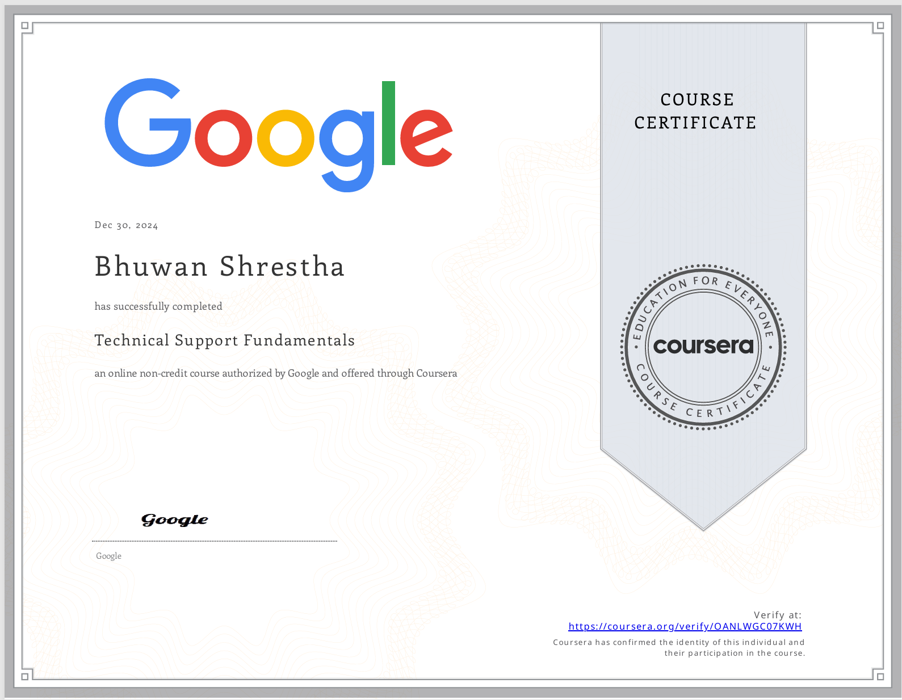

<ul>
  <li>This repository showcases my entire journey that I have gone through while taking the Google IT Support Professional Certificate Course. </li>
  <li>If you want to review and learn from this repositoy, please feel free to learn and contribute!!</li>
</ul>

<h2> About this Professional Certificate</h2>

This 5-course certificate, developed by Google, includes innovative curriculum designed to prepare you for an entry-level role in IT support. A job in IT can mean in-person or remote help desk work in a small business or at a global company like Google. The program is part of Grow with Google, a Google initiative to help create economic opportunity for all.

Upon completion of the certificate, you can share your information with top employers like Cognizant, GE Digital, Hulu, Infosys, Intel, KForce, MCPc, PNC Bank, RICOH USA, Sprint, TEKSystems, Veterans United Home Loans, Walmart and their subsidiaries, and of course, Google. You can also earn a CompTIA and Google dual credential when you complete the Google certificate and pass the CompTIA A+ certification exams.

Through a mix of video lectures, quizzes, and hands-on labs and widgets, the program will introduce you to troubleshooting, customer service, networking, operating systems, system administration and security. You’ll hear from Googlers with unique backgrounds whose own foundation in IT support served as a jumping off point for their careers. By dedicating ~5 hours a week, you can complete in under six months.

<h2>Skills you will gain:</h2>
<ul>
  <li>Binary Code</li>
  <li>Customer Support</li>
   <li>Linux</li>
  <li>Troubleshooting</li>
   <li>Domain Name System (DNS)</li>
  <li>IPv4</li>
   <li>Network Model</li>
  <li>Powershell</li>
  <li>Linux File System</li>
   <li>Command-Line Interface</li>
  <li>Directory Service</li>
   <li>Lightweight Directory Access Protocol</li>
  
</ul>
